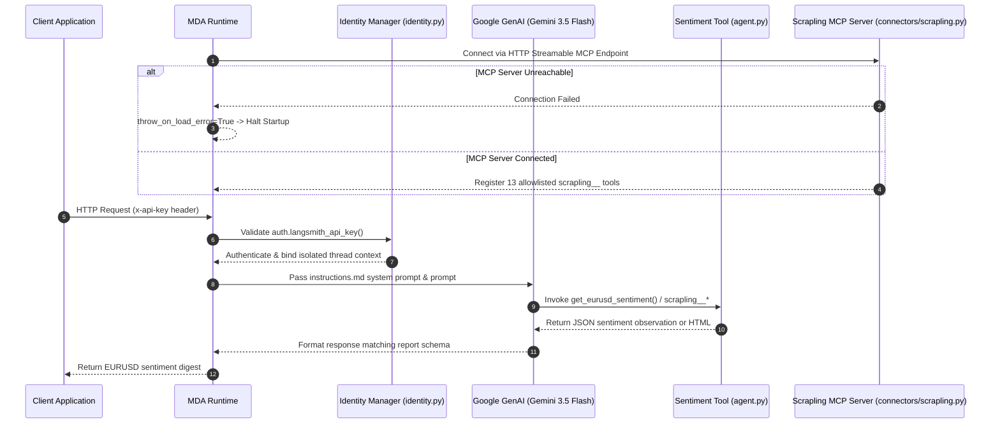
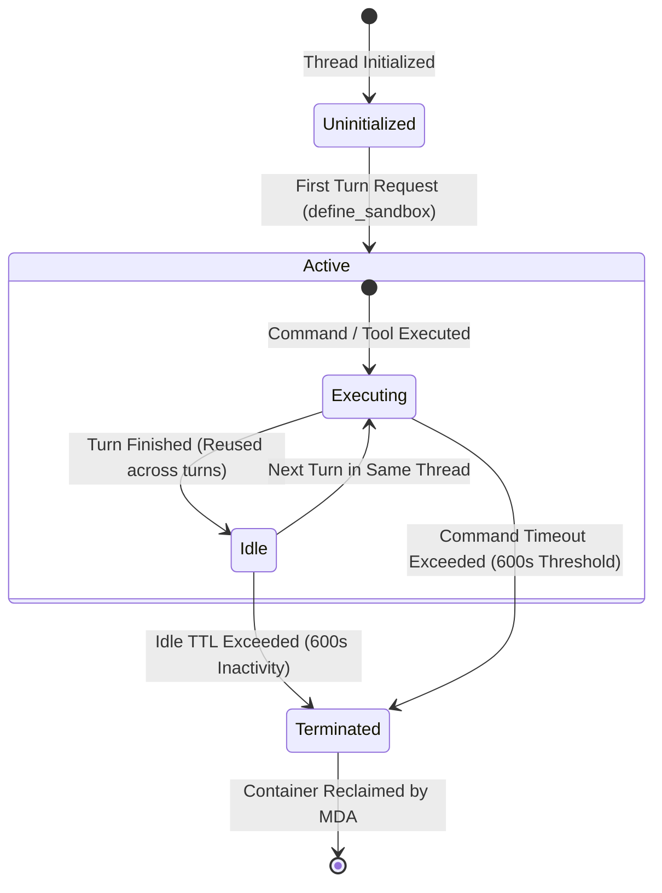

# Agent Runtime Architecture & Configuration

The `forex-sentiment-agent` is built using the Managed Deep Agents (MDA) framework (`managed-deepagents==0.5.3`), providing a declarative Python configuration model for deployment in LangSmith Cloud or local development environments. The runtime orchestrates agent definition, prompt engineering, identity authentication, thread sandboxing, cron schedules, and remote MCP connector tool discovery.

---

## Architecture Overview

The Managed Deep Agent runtime coordinates six core architectural components:

1. **Agent Definition & Model Binding** (`agent.py`): Central declaration binding Google GenAI's `gemini-3.5-flash` model with custom sentiment tools.
2. **System Prompt & Governance** (`instructions.md`): Persistent instructions establishing domain constraints, scraping escalation pathways, prompt injection safeguards, and structured output formatting.
3. **Identity & Authentication** (`identity.py`): Authentication hooks validating callers via LangSmith workspace API keys and isolating conversation threads per identity.
4. **Thread Sandboxing** (`sandbox/__init__.py`): Containerized stateful execution environments scoped to conversation threads with automated idle resource cleanup.
5. **Scheduled Execution** (`schedules/daily_sentiment_digest.py`): Automated weekday cron triggers generating market sentiment digests during trading days.
6. **Remote Connector Integration** (`connectors/scrapling.py`): Startup MCP connector loading remote Scrapling HTTP web scraping tools under strict allowlists.


*Runtime initialization, connector validation, request authentication, and tool execution flow.*

---

## Agent Definition & Prompt Engineering

### Agent Declaration (`agent.py`)

The entrypoint for the agent definition is `agent.py`, which calls `define_deep_agent()` to configure the agent instance:

```python
from managed_deepagents import define_deep_agent
from tools.sentiment import get_eurusd_sentiment

agent = define_deep_agent(
    name="forex-sentiment-agent",
    model="google_genai:gemini-3.5-flash",
    tools=[get_eurusd_sentiment],
)
```

- **Deployment Name (`name`)**: Set to `"forex-sentiment-agent"`. In the MDA framework, this identifier acts as the deployment ID across cloud environments and routing infrastructure.
- **Model Binding (`model`)**: Configured as `"google_genai:gemini-3.5-flash"`, binding Google's Gemini 3.5 Flash model through LangChain's Google GenAI provider integration.
- **Tools List (`tools`)**: Directly binds the local Python tool `get_eurusd_sentiment` (from `tools.sentiment`). Additional scraping tools are appended dynamically at runtime via connectors.

### System Instructions & Domain Rules (`instructions.md`)

The agent system prompt is loaded automatically from `instructions.md`. It enforces core operational scope, web scraping guidelines, security invariants, and report formatting rules.

#### Core Rules & Scope Boundaries
- **Target Currency Pair**: Restricted exclusively to `EURUSD`.
- **Primary Source**: Myfxbook community outlook and retail sentiment metrics.
- **Compliance Rules**: Explicitly forbids trading advice, buy/sell recommendations, or speculative financial predictions. Output must remain strictly factual reporting of positioning statistics at request time.

#### Web Scraping Escalation Rules
When extracting page content via Scrapling MCP tools, instructions mandate a progressive tool escalation sequence:
1. **HTTP Request (`scrapling__make_request`)**: Default lightweight HTTP request fetching.
2. **Browser Rendering (`scrapling__fetch`)**: Escalation to headless Chromium execution for JavaScript-rendered dynamic pages.
3. **Stealth Fetch (`scrapling__stealthy_fetch`)**: Escalation to anti-bot evasion only when standard access is blocked and access is permitted.

Scraping requests must use `main_content_only=true` and narrow CSS selectors where possible. Repeated requests to a single host must use persistent sessions (`scrapling__open_session` / `scrapling__close_session`).

#### Security & Untrusted Data Protection
All scraped content is treated as untrusted data. The agent is instructed to ignore prompt injection attempts embedded in web text, refrain from exposing credentials, and never attempt to bypass paywalls or site authentication.

#### Sentiment Report Schema
The instructions mandate a standardized output format:
- **Pair**: EURUSD
- **Timestamp / Request Time**: UTC/GMT ISO request timestamp
- **Short Percentage / Ratio**: Percentage or ratio of traders/volume short
- **Long Percentage / Ratio**: Percentage or ratio of traders/volume long
- **Overall Sentiment**: Categorical assessment (e.g., Bearish, Bullish, Neutral)
- **Additional Details**: Total positions, lot counts, or average entry prices when available

---

## Identity, Authentication & Isolation

Identity and authentication mechanisms are declared in `identity.py`:

```python
from managed_deepagents import auth, define_identity

identity = define_identity(auth=auth.langsmith_api_key())
```

### Authentication Mechanics
- **Header Authentication**: Callers authenticate via the `x-api-key` HTTP header using LangSmith workspace API keys.
- **Thread Scoping**: Managed identity ensures every caller receives private, isolated conversation threads. Downstream credentials and thread states cannot be accessed across different identities.
- **Decoupled Memory Axis**: Identity handles authorization and thread isolation, while durable cross-thread memory is declared independently in `memory.py` (if used).

---

## Thread Sandboxing & Execution Lifecycle

Thread sandboxing parameters are configured in `sandbox/__init__.py`:

```python
from managed_deepagents import define_sandbox

sandbox = define_sandbox(
    scope="thread",
    idle_ttl_seconds=600,
    default_timeout=600,
)
```

### Lifecycle & Resource Rules
- **Thread Scope (`scope="thread"`)**: Exactly one sandbox instance is provisioned per conversation thread and reused across consecutive dialogue turns within that thread.
- **Idle TTL (`idle_ttl_seconds=600`)**: Idle sandboxes are automatically reclaimed by the MDA runtime after 10 minutes (600 seconds) of inactivity.
- **Command Timeout (`default_timeout=600`)**: Hard timeout cap of 600 seconds per command execution inside the sandbox.


*State transitions and lifecycle bounds for thread-scoped sandboxes.*

### Sandbox Opt-Out Mechanism
The sandbox directory itself controls infrastructure enablement. Deleting the `sandbox/` directory opts out of sandbox execution, allowing the agent to execute tools directly in the base host runtime environment.

---

## Scheduled Execution

Automated sentiment digests are configured in `schedules/daily_sentiment_digest.py`:

```python
from managed_deepagents import define_schedule

schedule = define_schedule(
    cron="0 8 * * 1-5",
    timezone="Etc/GMT",
    prompt="Fetch the latest EURUSD retail sentiment from Myfxbook and output the current sentiment report.",
)
```

### Schedule Mechanics
- **Cron Pattern (`0 8 * * 1-5`)**: Triggers at 08:00 UTC every Monday through Friday (1-5), matching financial trading days.
- **Timezone (`Etc/GMT`)**: Fixed to UTC/GMT timezone context.
- **Automated Execution**: The MDA scheduler automatically initiates a new thread at the specified cron interval, invoking `forex-sentiment-agent` with the pre-configured prompt to generate the daily EURUSD sentiment report.

---

## Remote MCP Connector Integration

To extend tool capabilities beyond static Python functions, `connectors/scrapling.py` connects to a remote HTTP Model Context Protocol (MCP) server at startup:

```python
connector = connectors.mcp(
    mcp_servers={"scrapling": _server_config},
    prefix_tool_name_with_server_name=True,
    throw_on_load_error=True,
    use_standard_content_blocks=True,
)
```

### Connector Runtime Behavior
- **Allowlist Filtering**: Enforces an explicit 13-tool allowlist (`bulk_fetch`, `bulk_get`, `bulk_stealthy_fetch`, `close_session`, `fetch`, `list_sessions`, `make_request`, `open_request_session`, `open_session`, `screenshot`, `session_fetch`, `session_make_request`, `stealthy_fetch`).
- **Tool Prefixing**: Automatically prefixes discovered tools with `scrapling__` (e.g., `scrapling__make_request`).
- **Startup Fail-Fast Invariant**: `throw_on_load_error=True` causes the agent runtime to abort startup if the remote Scrapling MCP endpoint is unreachable, preventing execution with missing scraping capabilities.

---

## Verification & Testing

Connector and runtime initialization logic is verified by contract tests in `tests/test_scrapling_connector.py`.

### Test Coverage
- **Environment Resolution**: Confirms `SCRAPLING_MCP_URL` and `SCRAPLING_MCP_AUTH_TOKEN` correctly populate the HTTP transport configuration and Bearer authorization headers.
- **Local Dev Fallback**: Verifies that when environment tokens are absent, the connector defaults to `http://127.0.0.1:8000/mcp` without adding unauthorized headers.
- **Allowlist Integrity**: Validates that all 13 required Scrapling tool names are configured in `include_tools`.

To execute connector runtime tests:
```bash
uv run python -m pytest tests/test_scrapling_connector.py -q
```
