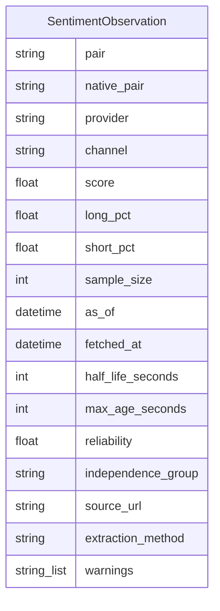
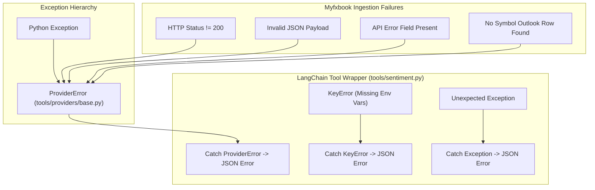
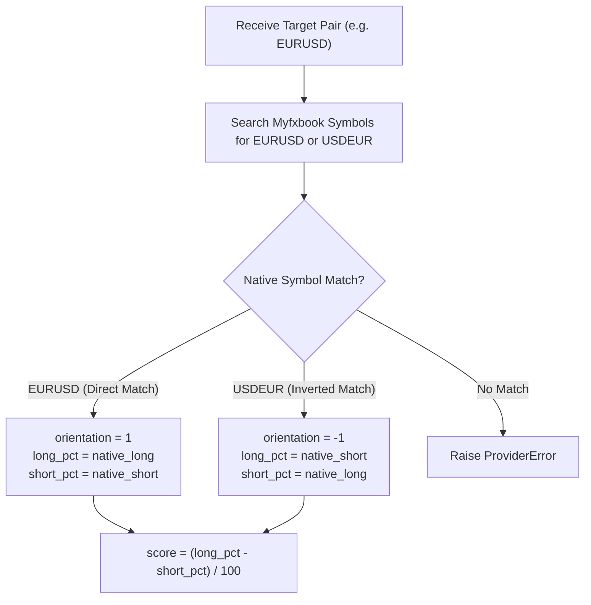

# Sentiment Data Models & Provider Abstractions

The market sentiment ingestion layer normalizes retail trader positioning data from external forex analytics providers into standard data structures. By decoupling provider-specific API payloads from agent reasoning workflows, the system provides consistent metrics for EURUSD long/short positioning, calculated sentiment scores, data fresh decay parameters, and provider error reporting.


*Figure 1: `SentimentObservation` entity schema and attribute model.*

---

## Provider Exception Hierarchy

All external sentiment provider operations inherit from a dedicated exception taxonomy rooted at `ProviderError` defined in `tools/providers/base.py`.


*Figure 2: Exception propagation from Myfxbook provider through ProviderError to tool wrappers.*

### Exception Class Definition

`ProviderError` derives directly from standard Python `Exception` and acts as the root class for all external retrieval and parsing failures:

```python
class ProviderError(Exception):
    """Raised when an external provider fails to fetch or parse data."""
    pass
```

### Exception Safety & Secret Redaction

Provider HTTP interactions deliberately avoid calling `httpx.Response.raise_for_status()`. Because HTTP GET query parameters contain authentication credentials (such as `email`, `password`, or `session` tokens), standard HTTP error formatting could leak secrets into log traces or error messages. Instead, `tools/providers/myfxbook.py` implements custom status verification:

1. **HTTP Status Verification**: Manually checks `response.status_code != 200` and raises `ProviderError(f"myfxbook HTTP status {response.status_code}")`.
2. **JSON Parsing Failure**: Catches `ValueError` during JSON decoding and raises `ProviderError("myfxbook returned invalid JSON") from exc`.
3. **API Level Errors**: Inspects response JSON for top-level `error` keys and raises `ProviderError("myfxbook reported an API error")`.
4. **Missing Symbol Rows**: Raises `ProviderError(f"myfxbook has no outlook row for {wanted}")` if the target symbol cannot be located in provider output.

### Clean Resource Teardown

During session lifecycle management in `tools/providers/myfxbook.py`, logout calls are executed in a `finally` block to prevent session leakage. Any `ProviderError` raised during logout is silently swallowed so that secondary teardown errors do not override primary data retrieval exceptions.

---

## SentimentObservation Data Schema

The `SentimentObservation` class in `models.py` defines the canonical Pydantic model for retail market positioning metrics and observation metadata.

| Field Name | Type | Default Value | Description |
| :--- | :--- | :--- | :--- |
| `pair` | `str` | *(required)* | Standardized target currency pair symbol (e.g., `"EURUSD"`). |
| `native_pair` | `str` | *(required)* | Native symbol string returned by provider (e.g., `"EURUSD"` or `"USDEUR"`). |
| `provider` | `str` | *(required)* | Identifier of the data provider (e.g., `"myfxbook"`). |
| `channel` | `str` | *(required)* | Positioning data channel (e.g., `"retail_positioning"`). |
| `score` | `float` | *(required)* | Normalized sentiment score in range `[-1.0, +1.0]`. |
| `long_pct` | `float` | *(required)* | Percentage of long positions aligned to the target `pair` orientation. |
| `short_pct` | `float` | *(required)* | Percentage of short positions aligned to the target `pair` orientation. |
| `sample_size` | `int` | `0` | Total position count (`totalPositions`) reporting sentiment data. |
| `as_of` | `datetime` | *(required)* | UTC timestamp representing the data observation time. |
| `fetched_at` | `datetime` | *(required)* | UTC timestamp when data was retrieved from provider API. |
| `half_life_seconds` | `int` | `900` | Exponential decay half-life for observation freshness (15 minutes). |
| `max_age_seconds` | `int` | `3600` | Maximum age in seconds before observation is considered expired (1 hour). |
| `reliability` | `float` | `0.80` | Statistical weight / confidence rating of provider source (0.0 to 1.0). |
| `independence_group` | `str` | `"myfxbook"` | Grouping ID used to prevent double-counting non-independent provider feeds. |
| `source_url` | `str` | `"https://www.myfxbook.com/api"` | Base API endpoint URL for data auditability. |
| `extraction_method` | `str` | `"documented_api"` | Acquisition protocol type (e.g., `"documented_api"`). |
| `warnings` | `List[str]` | `[]` | List of informational warnings attached during extraction. |

---

## Symbol Orientation Mapping

Forex providers may report positioning data under either direct target orientation (e.g., `EURUSD`) or inverted pair naming (e.g., `USDEUR`). The ingestion logic standardizes all statistics relative to the requested target pair.


*Figure 3: Symbol orientation mapping logic for direct vs. inverted currency pairs.*

### Orientation Mapping Rules

Given a requested target pair `wanted` (e.g., `"EURUSD"`):
1. Compute the inverted symbol string `inverse = wanted[3:] + wanted[:3]` (e.g., `"USDEUR"`).
2. Scan the provider dataset for matching symbol names.
3. Compute the orientation factor:
   $$\text{orientation} = \begin{cases} 1 & \text{if } \text{native\_pair} == \text{wanted} \\ -1 & \text{if } \text{native\_pair} == \text{inverse} \end{cases}$$
4. Assign long/short percentages relative to target pair:
   - **Direct Orientation** ($\text{orientation} = 1$):
     $$\text{long\_pct} = \text{native\_long}, \quad \text{short\_pct} = \text{native\_short}$$
   - **Inverted Orientation** ($\text{orientation} = -1$):
     $$\text{long\_pct} = \text{native\_short}, \quad \text{short\_pct} = \text{native\_long}$$

Because being long `USDEUR` is equivalent to being short `EURUSD`, swapping percentages preserves directional consistency across all downstream analytics.

---

## Score Calculation & Reliability Metrics

### Sentiment Score Calculation

The normalized sentiment score represents net retail positioning bias on a continuous scale from `-1.0` (100% short) to `+1.0` (100% long):

$$\text{score} = \frac{\text{long\_pct} - \text{short\_pct}}{100}$$

- **`score > 0`**: Net retail long bias (e.g., `long_pct = 70.0`, `short_pct = 30.0` $\rightarrow$ `score = +0.40`).
- **`score < 0`**: Net retail short bias (e.g., `long_pct = 25.0`, `short_pct = 75.0` $\rightarrow$ `score = -0.50`).
- **`score = 0`**: Balanced retail positioning (`long_pct = 50.0`, `short_pct = 50.0` $\rightarrow$ `score = 0.0`).

### Reliability & Freshness Parameters

1. **Reliability Score (`0.80`)**: Represents the baseline confidence weight assigned to Myfxbook retail community data relative to institutional positioning feeds (such as COT reports).
2. **Half-Life Decay (`900` seconds / 15 minutes)**: Specifies the rate at which observation weights decay over time for time-weighted sentiment aggregation algorithms.
3. **Max Age Cutoff (`3600` seconds / 1 hour)**: Defines the hard staleness boundary beyond which an observation must be re-fetched.
4. **Sample Size (`sample_size`)**: Populated from provider `totalPositions` to record total active positions contributing to the sentiment metric.

---

## Provider Contracts & Tool Integration

### Provider Contract (`tools/providers/myfxbook.py`)

The Myfxbook provider manages HTTP authentication and session lifecycle:

1. Authenticates against `/api/login.json` using `MYFXBOOK_EMAIL` and `MYFXBOOK_PASSWORD`.
2. Extracts and unquotes the session token.
3. Requests `/api/get-community-outlook.json` with the active session token.
4. Ensures session destruction via `/api/logout.json` inside a `finally` block.
5. Maps response data to `SentimentObservation` with `warnings=["API exposes retrieval time, not a separate observation timestamp."]`.

### Agent Tool Interface (`tools/sentiment.py`)

The `@tool` wrapped function `get_eurusd_sentiment()` exposes sentiment data to the Managed Deep Agents runtime:

```python
@tool
async def get_eurusd_sentiment() -> str:
    """Fetch the latest EURUSD retail sentiment directly from Myfxbook."""
```

The tool executes `fetch_myfxbook("EURUSD")` and returns formatted JSON containing:
- Ingestion metrics: `pair`, `provider`, `long_percentage`, `short_percentage`, `score`, `sample_size`.
- Timestamps: ISO-formatted `fetched_at` and `as_of`.
- Metadata: `warnings` list.

If execution fails, the tool catches `ProviderError`, `KeyError` (missing credentials), or general `Exception`, returning a JSON error payload (`{"error": "..."}`) to enable graceful agent fallback reasoning.
