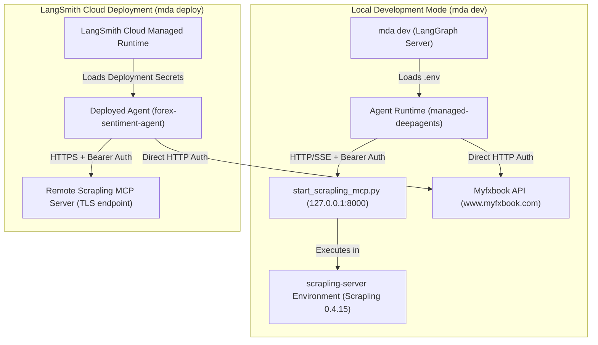

# Operations, Environment & Cloud Deployment

This document provides the operational guidelines for running, configuring, testing, and deploying the Forex Sentiment Agent (`forex-sentiment-agent`). It explains local development workflows using the Managed Deep Agent (`mda`) CLI, environment secret handling, the isolated dual-environment Python architecture, and production deployment to LangSmith Cloud.

---

## 1. Operational Architecture & Environment Isolation

The deployment architecture separates the agent execution runtime from external model APIs, data providers, and the web scraping server.


*Local development and LangSmith Cloud deployment architecture highlighting environment isolation and Scrapling MCP server connectivity.*

### Dual Python Environment Rationale

The project uses two separate Python environments:

1. **Root Agent Environment (`pyproject.toml`)**: Contains `managed-deepagents==0.5.3`, `httpx`, `langchain-core`, and `pydantic`. The MDA 0.5.3 connector runtime uses `langchain-mcp-adapters`, which depends on MCP SDK 1.x.
2. **Isolated Scrapling Server Environment (`scrapling-server/pyproject.toml`)**: Contains `scrapling[ai]==0.4.15`, which depends on MCP SDK 2.x.

Decoupling the Scrapling HTTP MCP server from the agent client prevents an unsatisfiable single-environment dependency conflict while allowing both components to run on modern dependencies.

---

## 2. Environment Dependencies & Secret Management

The system relies on environment variables for API authentication, provider credentials, and inter-service connectivity.

### Environment Variable Reference

| Environment Variable | Required For | Default / Format | Description |
| :--- | :--- | :--- | :--- |
| `LANGSMITH_API_KEY` | Deployment & Tracing | `lsv2_pt_...` | Authentication key for LangSmith Cloud and `mda` CLI operations. |
| `LANGSMITH_WORKSPACE_ID` | Deployment (Optional) | UUID string | Workspace target if the LangSmith key spans multiple workspaces. |
| `MYFXBOOK_EMAIL` | Myfxbook Provider | Email address | Login email for Myfxbook API session creation (`login.json`). |
| `MYFXBOOK_PASSWORD` | Myfxbook Provider | Plaintext secret | Password for Myfxbook API authentication. |
| `SCRAPLING_MCP_URL` | Scrapling Connector | `http://127.0.0.1:8000/mcp` | Target HTTP/SSE MCP endpoint for Scrapling web scraping tools. |
| `SCRAPLING_MCP_AUTH_TOKEN` | Scrapling Server & Client | 64-char hex string | Shared Bearer token used to authenticate calls to Scrapling MCP server. |
| `GOOGLE_API_KEY` / `GEMINI_API_KEY` | LLM Inference | `AIzaSy...` | Model provider key for Google Gemini (e.g., `google_genai:gemini-3.5-flash`). |

### Secret Forwarding Mechanics

`mda deploy` loads the root `.env` file at deploy time. Non-reserved environment variables defined in `.env` (such as `MYFXBOOK_EMAIL`, `MYFXBOOK_PASSWORD`, and model provider keys) are automatically forwarded to LangSmith Cloud as secure deployment secrets.

* **Shell Environment Precedence**: `mda deploy` reads provider credentials from `.env` or LangSmith workspace secrets; variables set solely in the shell environment (except `LANGSMITH_API_KEY` and `LANGSMITH_WORKSPACE_ID`) are not forwarded.
* **Security Invariant**: Never commit `.env` or plain secret strings to version control. Use `.env.example` as a template.

---

## 3. Local Development Workflow

### Step 1: Environment Installation

Install dependencies for both Python environments and provision Playwright browser binaries for Scrapling:

```bash
uv sync
uv sync --project scrapling-server
uv run --project scrapling-server --frozen scrapling install --force
```

### Step 2: Start the Local Scrapling MCP Server

Generate a secure token and run the Scrapling HTTP MCP launcher script:

```bash
export SCRAPLING_MCP_AUTH_TOKEN="$(openssl rand -hex 32)"
export SCRAPLING_MCP_URL="http://127.0.0.1:8000/mcp"

uv run python scripts/start_scrapling_mcp.py
```

#### Launcher Options & Security Invariants

The `scripts/start_scrapling_mcp.py` launcher supports the following command-line flags:

* `--host`: Listen address (defaults to `SCRAPLING_MCP_HOST` environment variable or `127.0.0.1`).
* `--port`: Listen port (defaults to `SCRAPLING_MCP_PORT` or `8000`).
* `--allowed-host`: Accepted `Host` headers (can be specified multiple times for public hostnames).

**Security Invariants**:
* The launcher checks `os.environ` for `SCRAPLING_MCP_AUTH_TOKEN` and immediately exits with status code `2` if missing.
* The launcher replaces its own process using `os.execvpe` to ensure OS signals (such as `SIGINT` / Ctrl-C) are handled directly by the underlying `scrapling-mcp` HTTP server.

### Step 3: Run the Local Agent Server

In a second terminal (ensuring `.env` contains matching `SCRAPLING_MCP_AUTH_TOKEN` and `SCRAPLING_MCP_URL` entries), launch the agent dev server:

```bash
mda dev
```

`mda dev` runs the agent on a local LangGraph server. It automatically locates `uv` on `PATH` to resolve dependencies without requiring a globally installed `langgraph` binary.

### Connector Initialization Invariants

When `mda dev` or `mda deploy` initializes the agent runtime, `connectors/scrapling.py` connects to `SCRAPLING_MCP_URL`.
* **Fail-Fast Startup**: The connector is configured with `throw_on_load_error=True`. If the Scrapling HTTP endpoint cannot be reached, agent initialization fails immediately instead of silently dropping tools.
* **Tool Prefixing**: The connector automatically prefixes all 13 allowlisted tools with `scrapling__` (e.g., `scrapling__make_request`, `scrapling__fetch`, `scrapling__stealthy_fetch`).

---

## 4. LangSmith Cloud Deployment & Remote Operations

Because LangSmith Cloud servers cannot reach `127.0.0.1` on a developer machine, production deployments require hosting the Scrapling server on a remote network-accessible host.

### Remote Scrapling Server Setup

1. Deploy the `scrapling-server` project to a remote server or container host.
2. Bind the server to all interfaces and specify allowed public hostnames:
   ```bash
   uv run --project scrapling-server scrapling-mcp --http --host 0.0.0.0 --port 8000 --allowed-host scrapling.example.com:443
   ```
3. Terminate TLS (HTTPS) in front of the server.
4. Update the root `.env` before deploying the agent:
   ```text
   SCRAPLING_MCP_URL=https://scrapling.example.com/mcp
   SCRAPLING_MCP_AUTH_TOKEN=<remote-server-secret-token>
   ```

### Deployment Commands (`mda deploy`)

Deploy the agent project to LangSmith Cloud:

```bash
mda deploy
```

#### Deployment Execution Flow

1. **Compilation**: `mda deploy` copies project files verbatim, generates an entry module, and writes a deployable build artifact (including `langgraph.json`) to `.mda/build`.
2. **Secret Upload**: Non-reserved `.env` keys are securely uploaded to the deployment.
3. **Cloud Provisioning**: Uploads `.mda/build` to LangSmith Cloud to instantiate the managed agent runtime.
4. **URL Output**: Prints both the Agent Server API URL for client invocation and the LangSmith Dashboard URL for inspection and tracing.

#### Common Deployment Flags

* `--name`: Set explicit deployment ID (e.g., `mda deploy --name forex-sentiment-agent-dev`).
* `--deployment-type`: Specify environment type (e.g., `--deployment-type dev` or `prod`).
* `--workspace-id`: Target a specific LangSmith workspace ID (`$LANGSMITH_WORKSPACE_ID`).
* `--no-wait`: Return immediately after build upload without blocking for health checks.

### Managed Identity & Thread Sandboxes

* **Managed Identity (`identity.py`)**: Declares `auth.langsmith_api_key()`, requiring callers to pass an `x-api-key` header while providing caller-isolated conversation threads and memory boundaries.
* **Managed Sandboxes (`sandbox/__init__.py`)**: Provisions thread-scoped LangSmith sandboxes (`scope="thread"`) with an idle TTL of 600 seconds (10 minutes) and a default command execution timeout of 600 seconds.

### Monitoring & Log Streaming (`mda logs`)

Stream real-time server logs from the deployed cloud instance:

```bash
mda logs
```

* **Interactive Mode**: Streams logs continuously until Ctrl-C is pressed.
* **Non-Interactive / Piped Mode**: Outputs the most recent log lines (default 1000 lines) and exits.
* **Filter Flags**: Pass `--lines <n>` or `--level error` to filter log output (e.g., `mda logs --lines 200 --level error`).

### Teardown & Resource Cleanup (`mda delete`)

De-provision the deployment and clean up associated cloud resources:

```bash
mda delete
```

* **Resources Removed**: Deletes the cloud deployment instance, the associated LangSmith tracing project, the Context Hub repository holding agent context and memory, and active managed sandboxes.
* **Confirmation Invariant**: Interactive prompt requires confirmation unless `--yes` is specified (`mda delete --yes`). Note that deleted agent thread history and memory cannot be recovered.

---

## 5. Testing & Operational Verification

### Unit & Contract Tests

Run offline contract and security tests to verify connector configuration and launcher guardrails:

```bash
uv run python -m pytest -q
```

* **Connector Contract (`tests/test_scrapling_connector.py`)**: Validates HTTP transport configuration, tool inclusion list (13 tools), timeout settings, tool prefixing (`scrapling__`), and environment fallback defaults.
* **Launcher Security (`tests/test_scrapling_launcher.py`)**: Verifies that the launcher refuses to start when `SCRAPLING_MCP_AUTH_TOKEN` is omitted from the environment.

### Live Integration Smoke Test

To verify end-to-end MCP HTTP communication and web scraping against live endpoints:

```bash
RUN_SCRAPLING_MCP_LIVE=1 uv run python -m pytest tests/test_scrapling_mcp_live.py -q
```

The live test suite (`tests/test_scrapling_mcp_live.py`):
1. Starts an authenticated Scrapling server on a dynamic local port.
2. Asserts that unauthenticated HTTP requests to `/mcp` return `401 Unauthorized`.
3. Connects the agent runtime, verifies discovery of all 13 `scrapling__*` tools.
4. Invokes both HTTP fetch (`scrapling__make_request`) and Playwright browser fetch (`scrapling__fetch`) against `https://example.com`.

### Local Build Validation

Validate project packaging locally without uploading to LangSmith Cloud:

```bash
mda build
```

This compiles local agent artifacts into `.mda/build` to verify that `langgraph.json` and generated runtime entry points build cleanly.
