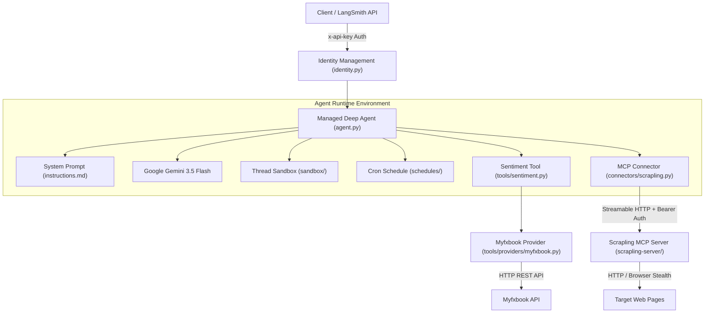

# Quickstart & System Map

The **Forex Sentiment Agent** is an automated market intelligence agent built with the Managed Deep Agents (`managed-deepagents`) framework. It monitors and analyzes retail forex sentiment specifically for the **EURUSD** currency pair, pulling primary positioning metrics directly from Myfxbook and using remote Scrapling web scraping tools when deep page inspection is authorized.

This page serves as the entry point for developers and operators. It provides a task-routing map across the documentation library, an architectural overview of components, and a step-by-step developer quickstart guide.

---

## Task-Routing Map

Use this map to navigate directly to detailed documentation based on your immediate task or development objective:

| Developer Goal / Objective | Target Documentation Guide | Key System Topics Covered |
| --- | --- | --- |
| **Understand agent runtime, identity, sandboxes, or cron schedules** | [/openwiki/architecture/agent-runtime.md](/openwiki/architecture/agent-runtime.md) | `agent.py` configuration, `google_genai:gemini-3.5-flash` model setup, `identity.py` authentication, thread-scoped `sandbox/` execution, and `schedules/` cron definitions. |
| **Examine sentiment metrics, Pydantic schemas, and data providers** | [/openwiki/concepts/sentiment-data-model.md](/openwiki/concepts/sentiment-data-model.md) | `SentimentObservation` schema, `tools/providers/myfxbook.py` session handling, positioning score calculation, and provider error handling. |
| **Configure or extend Scrapling MCP web scraping connectors** | [/openwiki/integrations/scrapling-mcp.md](/openwiki/integrations/scrapling-mcp.md) | Streamable HTTP MCP connector in `connectors/scrapling.py`, isolated `scrapling-server` environment, allowlisted `scrapling__*` tools, and scraping security guardrails. |
| **Deploy to LangSmith Cloud, manage secrets, or view logs** | [/openwiki/operations/deployment.md](/openwiki/operations/deployment.md) | Environment configuration (`.env`), running `mda dev`, deploying with `mda deploy`, streaming logs with `mda logs`, and environment variable propagation. |
| **Run unit tests, security tests, live MCP tests, or agent evals** | [/openwiki/testing/test-suite.md](/openwiki/testing/test-suite.md) | Connector contract tests, launcher security tests, opt-in live scraping integration tests (`RUN_SCRAPLING_MCP_LIVE=1`), and Harbor agent evaluation tasks. |
| **Trace end-to-end sentiment retrieval and tool execution flow** | [/openwiki/workflows/sentiment-retrieval.md](/openwiki/workflows/sentiment-retrieval.md) | Step-by-step control flow of `get_eurusd_sentiment`, Myfxbook authentication lifecycle, JSON payload formatting, and prompt formatting guardrails. |

---

## System Architecture Overview

The system combines a Managed Deep Agent runtime with an isolated, remote Model Context Protocol (MCP) scraping server. The main agent process uses `managed-deepagents` 0.5.3, while Scrapling web scraping capabilities run in an isolated server sub-environment to prevent MCP protocol version incompatibilities.


High-level component architecture and control flow of the Forex Sentiment Agent system.

### Core Component Map

The codebase is organized into explicit domain modules:

- **Agent Core (`agent.py`, `instructions.md`)**: Configures the deep agent instance (`forex-sentiment-agent`), selects the model (`google_genai:gemini-3.5-flash`), registers custom tools, and defines system prompt guardrails that enforce EURUSD scope and prohibit financial advice.
- **Authentication & Sandbox (`identity.py`, `sandbox/__init__.py`)**: Configures LangSmith API key authorization (`auth.langsmith_api_key()`) for caller thread isolation, and provisions thread-scoped sandboxes with 600-second idle TTL and command timeouts.
- **Scheduled Triggers (`schedules/daily_sentiment_digest.py`)**: Declares automated cron execution scheduled at `0 8 * * 1-5` (Etc/GMT) to deliver weekday EURUSD sentiment reports.
- **Sentiment Tools & Data Provider (`tools/sentiment.py`, `tools/providers/myfxbook.py`, `models.py`)**: Implements the `@tool` wrapper `get_eurusd_sentiment`, which authenticates with Myfxbook, fetches community outlook metrics, converts percentages into a normalized score (`(long_pct - short_pct) / 100`), and returns a structured JSON payload based on `SentimentObservation`.
- **Scrapling MCP Integration (`connectors/scrapling.py`, `scrapling-server/`, `scripts/start_scrapling_mcp.py`)**: Connects the agent to a remote Streamable HTTP MCP server exporting 13 allowlisted scraping tools with the `scrapling__` prefix. Runs in a dedicated `scrapling-server/` virtual environment to isolate Scrapling 0.4.15 (MCP 2.x) from the agent runtime (MCP 1.x via `langchain-mcp-adapters`).

---

## Developer Quickstart

Follow these steps to set up, run, test, and deploy the agent locally and to cloud environments.

### 1. Installation

Install dependencies for both the agent runtime and the isolated Scrapling MCP server:

```bash
# Sync root agent dependencies (managed-deepagents, httpx, pydantic, etc.)
uv sync

# Sync isolated Scrapling MCP server dependencies (scrapling[ai]==0.4.15)
uv sync --project scrapling-server

# Install Scrapling browser dependencies (Chromium/Playwright drivers)
uv run --project scrapling-server --frozen scrapling install --force
```

### 2. Environment Configuration

Copy `.env.example` to `.env` and fill in the required environment variables:

```bash
# Model Provider
GEMINI_API_KEY="your-gemini-api-key"

# LangSmith Cloud & Agent Authentication
LANGSMITH_API_KEY="your-langsmith-api-key"

# Myfxbook Data Source Credentials
MYFXBOOK_EMAIL="your-myfxbook-email"
MYFXBOOK_PASSWORD="your-myfxbook-password"

# Local Scrapling MCP Server Settings (Optional / Configurable)
SCRAPLING_MCP_URL="http://127.0.0.1:8000/mcp"
SCRAPLING_MCP_AUTH_TOKEN="generated-bearer-token"
```

### 3. Running Local Development

To run the agent locally with web scraping capabilities enabled, open two terminal sessions:

**Terminal 1: Start the authenticated Scrapling MCP Server**
```bash
export SCRAPLING_MCP_AUTH_TOKEN="$(openssl rand -hex 32)"
export SCRAPLING_MCP_URL="http://127.0.0.1:8000/mcp"

uv run python scripts/start_scrapling_mcp.py
```
*(Note: The server script requires `SCRAPLING_MCP_AUTH_TOKEN` and will refuse to start unauthenticated.)*

**Terminal 2: Run the LangGraph Dev Server**
```bash
export SCRAPLING_MCP_AUTH_TOKEN="<same token generated above>"
export SCRAPLING_MCP_URL="http://127.0.0.1:8000/mcp"

mda dev
```

### 4. Running Tests & Evaluations

Run the test suite to verify connector configuration, security rules, and live scraping functionality:

```bash
# Standard unit and security contract tests (skips live network calls)
uv run python -m pytest -q

# Opt-in live test (starts local MCP server and fetches real pages)
RUN_SCRAPLING_MCP_LIVE=1 uv run python -m pytest tests/test_scrapling_mcp_live.py -q

# Build check
mda build
```

To run agent evaluations using Harbor:

```bash
# Initialize a new evaluation scaffold (optional)
mda evals init my-task

# Compile agent and evals
mda evals compile ./forex-sentiment-agent
```

### 5. Deployment & Operations

To deploy the agent to LangSmith Cloud:

```bash
# Compile and deploy to LangSmith
mda deploy

# Inspect streaming server logs
mda logs

# Delete deployment and associated cloud resources
mda delete
```
