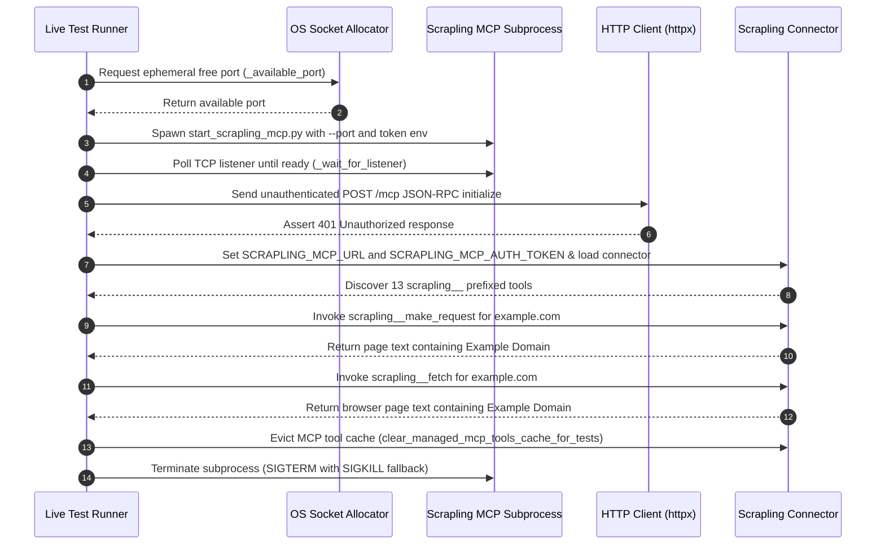

# Testing & Verification Strategy

The Managed Deep Agents test suite enforces strict contract invariants, launcher security controls, and optional end-to-end integration validation for external tools and connectors. Testing is organized into a two-tier verification model: fast, offline contract and unit tests that run by default in local development and CI pipelines, and an opt-in live integration test suite that spawns isolated background server processes and executes real web extractions.

---

## Test Organization & Suite Overview

The test suite is structured into three dedicated test modules located in `tests/`:

| Test Module | Primary Scope | Default Execution | Dependencies |
| :--- | :--- | :--- | :--- |
| `tests/test_scrapling_connector.py` | Connector contract tests (URL defaults, bearer token headers, 13-tool allowlist, timeouts, load flags) | Always executed | Python standard library, `connectors.scrapling` |
| `tests/test_scrapling_launcher.py` | Security contract tests for local MCP server launcher (`scripts/start_scrapling_mcp.py`) | Always executed | Subprocess execution, Python executable |
| `tests/test_scrapling_mcp_live.py` | Opt-in live end-to-end integration test (server process lifecycle, 401 guard, tool discovery, live HTTP/browser extractions) | Opt-in (`RUN_SCRAPLING_MCP_LIVE=1`) | `uv`, internet access (`example.com`), `httpx`, `scrapling-server` |

---

## Connector Contract Invariants (`tests/test_scrapling_connector.py`)

The connector contract test suite verifies that `connectors/scrapling.py` correctly constructs the Managed Deep Agents (MDA) connector configuration block under varying environment settings without making external network calls.

### Dynamic Module Reloading Pattern

Because `connectors/scrapling.py` reads environment variables (`SCRAPLING_MCP_URL` and `SCRAPLING_MCP_AUTH_TOKEN`) at module evaluation time, the test suite isolates test cases by forcibly clearing module state. The helper function `_load_connector_module()` evicts cached entries from `sys.modules` before importing:

```python
def _load_connector_module():
    sys.modules.pop("connectors.scrapling", None)
    return importlib.import_module("connectors.scrapling")
```

This pattern guarantees that each test case executes against a clean module initialization regardless of execution order.

### Remote Server & Auth Header Verification

`test_connector_uses_remote_http_server_and_auth_from_environment` asserts that when explicit remote endpoints and authentication tokens are configured in the process environment:

- **Transport**: `server["transport"]` is set to `"http"`.
- **URL**: `server["url"]` mirrors `SCRAPLING_MCP_URL`.
- **Authorization**: `server["headers"]` contains `{"Authorization": "Bearer <SCRAPLING_MCP_AUTH_TOKEN>"}`.
- **Tool Allowlist**: `server["include_tools"]` strictly matches the expected 13 raw tool names (`EXPECTED_SCRAPLING_TOOLS`): `bulk_fetch`, `bulk_get`, `bulk_stealthy_fetch`, `close_session`, `fetch`, `list_sessions`, `make_request`, `open_request_session`, `open_session`, `screenshot`, `session_fetch`, `session_make_request`, and `stealthy_fetch`.
- **Tool Timeout**: `server["default_tool_timeout"]` defaults to `120.0` seconds to accommodate browser launches.
- **Framework Flags**: `prefix_tool_name_with_server_name` is `True`, `throw_on_load_error` is `True`, and `use_standard_content_blocks` is `True`.

### Default Local URL & Credential Isolation

`test_connector_defaults_to_local_server_without_inventing_credentials` verifies that when `SCRAPLING_MCP_URL` and `SCRAPLING_MCP_AUTH_TOKEN` are omitted:

- **Default URL**: The target URL defaults to `http://127.0.0.1:8000/mcp`.
- **Credential Absence**: The `headers` key is omitted entirely from the server configuration dictionary, ensuring the connector never invents fallback credentials or sends malformed `Authorization` headers.

---

## Launcher Security Contract (`tests/test_scrapling_launcher.py`)

Security contract tests validate that local development helpers enforce security constraints prior to initiating network listeners.

### Mandatory Authentication Enforcement

`test_launcher_refuses_to_start_without_authentication_token` verifies that `scripts/start_scrapling_mcp.py` refuses to start an HTTP server if `SCRAPLING_MCP_AUTH_TOKEN` is missing from the environment.

The test executes the launcher script as an isolated subprocess with `--port 18000` and an unauthenticated environment:

- **Exit Status**: The subprocess exits with return code `2`.
- **Error Output**: `stderr` contains the explicit diagnostic string `"SCRAPLING_MCP_AUTH_TOKEN is required"`.

This contract ensures that local HTTP servers cannot run in unauthenticated mode or silently downgrade security posture.

---

## Opt-In Live Integration Testing (`tests/test_scrapling_mcp_live.py`)

Live end-to-end integration testing validates the complete operational chain: spawning the isolated Scrapling MCP server via `uv`, enforcing HTTP authentication middleware, discovering prefixed tools, performing live extractions against `https://example.com`, and performing clean process teardown.

### Opt-In Flag Gating

Live testing involves background subprocess management and external HTTP/browser traffic. To prevent unexpected network requests or build delays during standard unit test execution, `tests/test_scrapling_mcp_live.py` is guarded by a pytest skip marker:

```python
pytestmark = pytest.mark.skipif(
    os.environ.get("RUN_SCRAPLING_MCP_LIVE") != "1",
    reason="set RUN_SCRAPLING_MCP_LIVE=1 to start the local server and scrape example.com",
)
```

### Server Lifecycle & Dynamic Port Binding

To prevent port binding conflicts during parallel test execution, the live test acquires a free ephemeral port prior to launching the server:

1. **Port Discovery (`_available_port`)**: Binds a temporary TCP socket to `127.0.0.1:0` to obtain an available port from the operating system.
2. **Subprocess Spawning**: Spawns `scripts/start_scrapling_mcp.py` using `subprocess.Popen` with `--port <port>`, passing `SCRAPLING_MCP_AUTH_TOKEN` and updating `PATH` to include the running Python executable directory so `uv` can execute inside the isolated environment.
3. **Readiness Polling (`_wait_for_listener`)**: Polls TCP socket connectivity to `127.0.0.1:port` with a 30-second deadline. If the process terminates prematurely, `_wait_for_listener` captures stdout/stderr and fails the test fast with diagnostic output.

### Pre-Authentication Guard Validation

Before testing authenticated connector operations, the live test validates that unauthenticated requests to the running server endpoint are rejected:

- Sends an unauthenticated HTTP POST request containing a JSON-RPC `initialize` payload to `http://127.0.0.1:<port>/mcp` via `httpx.post`.
- Asserts that the server returns an HTTP status code of `401 Unauthorized`.

### Live Tool Discovery & Execution

Once HTTP authentication is verified, the test configures environment variables, loads the connector module, and executes live operations:

- **Tool Discovery**: Invokes `connector.tools()` and asserts that all 13 tools are discovered with the `scrapling__` prefix (`EXPECTED_PREFIXED_TOOLS`: `scrapling__make_request`, `scrapling__fetch`, `scrapling__stealthy_fetch`, etc.).
- **Static HTTP Extraction**: Calls `scrapling__make_request.ainvoke()` via `asyncio.run` against `https://example.com` with `extraction_type="text"` and `main_content_only=True`, asserting that `"Example Domain"` is returned.
- **Browser Fetch Extraction**: Calls `scrapling__fetch.ainvoke()` via `asyncio.run` against `https://example.com` with `extraction_type="text"` and `main_content_only=True`, asserting that the headless Chromium rendering pipeline retrieves `"Example Domain"`.

### Resource Teardown & Cache Eviction

The live test guarantees process and memory cleanup in a `finally` block:

1. **Cache Eviction**: Calls `clear_managed_mcp_tools_cache_for_tests(connector)` from `managed_deepagents._connectors.mcp.load` to purge internal MDA MCP tool cache references.
2. **Subprocess Termination**: Issues `process.terminate()` (sending `SIGTERM`), waits up to 10 seconds, and falls back to `process.kill()` (`SIGKILL`) if the process fails to terminate cleanly within the deadline.

### Sequence Diagram: Live Integration Test Flow


*End-to-end lifecycle and assertion sequence for the opt-in live Scrapling MCP integration test.*

---

## Running the Test Suite

### Running Default Offline Tests

To run the standard contract and security test suite without triggering live network calls or background server processes:

```bash
pytest
```

Or using `uv`:

```bash
uv run pytest
```

To run individual contract test files:

```bash
pytest tests/test_scrapling_connector.py tests/test_scrapling_launcher.py
```

### Running Opt-In Live Integration Tests

To run the live Scrapling MCP integration test against `https://example.com`:

```bash
RUN_SCRAPLING_MCP_LIVE=1 pytest tests/test_scrapling_mcp_live.py
```

#### Live Test Prerequisites

- **Network Access**: Outbound HTTPS connectivity to `https://example.com`.
- **Environment Tools**: `uv` installed and available in system `PATH`.
- **Server Environment**: Isolated dependencies installed under `scrapling-server/` (`scrapling[ai]==0.4.15`).

---

## Related Pages

- [/openwiki/integrations/scrapling-mcp.md](/openwiki/integrations/scrapling-mcp.md) — Operational architecture, connector configuration, tool allowlists, and scraping safety guidelines for Scrapling MCP.
- [/openwiki/quickstart.md](/openwiki/quickstart.md) — Setup and execution guide for local agent development.
