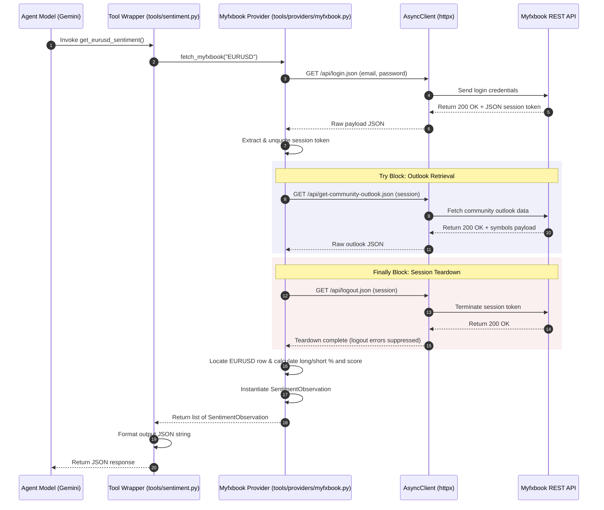
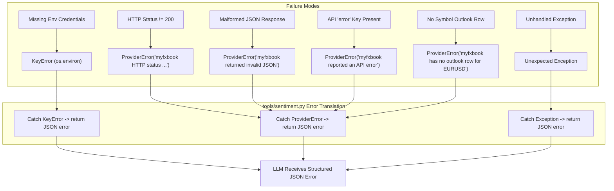

# End-to-End Sentiment Retrieval Workflow

The sentiment retrieval workflow connects the LLM reasoning agent (`forex-sentiment-agent`) with external retail forex market positioning data provided by the Myfxbook API. The workflow spans tool invocation, REST authentication, community outlook ingestion, pair orientation normalization, and structured error reporting.

---

## Workflow Overview & Architecture

When an LLM agent requires retail positioning metrics for `EURUSD`, it executes the `@tool`-decorated entrypoint `get_eurusd_sentiment()` defined in `tools/sentiment.py`. This tool delegates low-level HTTP network calls and data transformation to `fetch_myfxbook()` in `tools/providers/myfxbook.py`.

The flow decouples raw provider API structures from agent reasoning:

1. **Agent Tool Layer (`tools/sentiment.py`)**: Intercepts LLM tool invocations, invokes the provider, catches exceptions, and formats the output into a standardized JSON string payload.
2. **Provider Orchestration Layer (`tools/providers/myfxbook.py`)**: Manages Myfxbook session login/logout lifecycles over HTTP, queries community outlook data, identifies the target pair row, and normalizes symbol orientation.
3. **Domain Model Layer (`models.py`)**: Defines `SentimentObservation`, the Pydantic schema enforcing typing, score bounds, decay parameters, and metadata.
4. **Exception Hierarchy (`tools/providers/base.py`)**: Defines `ProviderError` as the base exception for network, parsing, and API-level ingestion failures.


*End-to-end sequence diagram illustrating authentication, outlook retrieval, session logout, and response formatting.*

---

## Detailed Control & Data Flow

### 1. LLM Tool Invocation (`tools/sentiment.py`)

The LLM invokes `get_eurusd_sentiment()` without parameters when responding to queries about EURUSD retail positioning:

```python
@tool
async def get_eurusd_sentiment() -> str:
    """Fetch the latest EURUSD retail sentiment directly from Myfxbook."""
```

The tool wrapper calls `fetch_myfxbook("EURUSD")`. Upon receiving a non-empty list of `SentimentObservation` instances, it extracts `obs = observations[0]` and serializes a JSON string containing:

- `pair`: `"EURUSD"`
- `provider`: `"myfxbook"`
- `long_percentage`: Long positioning percentage (e.g. `35.0`)
- `short_percentage`: Short positioning percentage (e.g. `65.0`)
- `score`: Normalized score between `-1.0` and `+1.0` (e.g. `-0.30`)
- `sample_size`: Total open positions count
- `fetched_at`: ISO 8601 UTC timestamp of retrieval
- `as_of`: ISO 8601 UTC timestamp of observation
- `warnings`: Explanatory warnings array

If `fetch_myfxbook` returns an empty list, `get_eurusd_sentiment` returns a JSON string error object: `{"error": "No sentiment observation returned for EURUSD."}`.

### 2. Provider HTTP Authentication & Ingestion (`tools/providers/myfxbook.py`)

The function `fetch_myfxbook(pair: str)` executes the retrieval pipeline:

1. **Client Configuration**: Creates an `httpx.AsyncClient` with `timeout = httpx.Timeout(10.0, connect=5.0)` and `follow_redirects=False`.
2. **Login & Session Token Acquisition**: Sends a GET request to `https://www.myfxbook.com/api/login.json` supplying `email` and `password` from `os.environ["MYFXBOOK_EMAIL"]` and `os.environ["MYFXBOOK_PASSWORD"]`.
3. **Session Token Decoding**: Reads the `"session"` key from the JSON payload and URL-unquotes it via `urllib.parse.unquote(login["session"])`.
4. **Data Retrieval & Teardown**:
   - Executes `get-community-outlook.json` passing `{"session": session}` inside a `try` block.
   - Executes `logout.json` passing `{"session": session}` inside a `finally` block to invalidate the remote session.

### 3. Symbol Search, Orientation & Score Calculation

Myfxbook returns an array of symbol outlook objects in `data["symbols"]`. The provider searches for matching symbol rows for both direct (`"EURUSD"`) and inverse (`"USDEUR"`) symbol strings:

```python
wanted = pair.upper()
inverse = wanted[3:] + wanted[:3]
row = next((x for x in data["symbols"] if x["name"].upper() in {wanted, inverse}), None)
```

If a row is found, the provider calculates metrics based on symbol orientation:

- **Direct Symbol (`native == wanted`)**: Orientation multiplier is `1`. `long_pct` and `short_pct` match `longPercentage` and `shortPercentage` directly.
- **Inverse Symbol (`native != wanted`)**: Orientation multiplier is `-1`. `long_pct` and `short_pct` are swapped (`long_pct = native_short`, `short_pct = native_long`).
- **Normalized Score**: Calculated as `(long_pct - short_pct) / 100`. A positive score indicates net retail long bias (bullish retail), while a negative score indicates net retail short bias (bearish retail).
- **Sample Size**: Extracted as `int(row.get("totalPositions") or 0)`.

The data is wrapped in a `SentimentObservation` instance with `half_life_seconds=900`, `max_age_seconds=3600`, and `reliability=0.80`, along with warning text `"API exposes retrieval time, not a separate observation timestamp."`.

---

## Error Handling & Failure Semantics

The workflow provides multi-tiered error handling across network, API, parsing, environment, and application layers:


*Flowchart mapping failure modes to ProviderError exceptions and JSON error payloads.*

### 1. Missing Environment Credentials (`KeyError`)
If `MYFXBOOK_EMAIL` or `MYFXBOOK_PASSWORD` is absent from `os.environ`, accessing `os.environ[...]` raises a Python `KeyError`. The `get_eurusd_sentiment()` tool catches `KeyError` and returns a JSON error response:
```json
{
  "error": "Missing environment variable: 'MYFXBOOK_EMAIL'"
}
```

### 2. HTTP Status Failures & Credential Redaction
The internal `_get` helper checks `response.status_code != 200`. It deliberately avoids `httpx.Response.raise_for_status()` because HTTP GET query strings contain sensitive URL parameters (`email`, `password`, `session`). Using `raise_for_status()` could output full request URLs into exception tracebacks or logs.

Instead, `_get` raises `ProviderError(f"myfxbook HTTP status {response.status_code}")` with redacted URL details.

### 3. Invalid JSON Parsing Failures
If Myfxbook returns non-JSON or corrupted payloads (e.g., HTML error pages during outages), `response.json()` raises `ValueError`. The helper catches `ValueError` and raises:
```python
raise ProviderError("myfxbook returned invalid JSON") from exc
```

### 4. API Error Payload Verification
Myfxbook REST endpoints return JSON payloads containing `{"error": true, "message": "..."}` on logical errors (such as invalid credentials or expired sessions). If `payload.get("error")` evaluates to true, `_get` raises `ProviderError("myfxbook reported an API error")`.

### 5. Missing Symbol Outlook Rows
If the response `data["symbols"]` array does not contain an entry matching `EURUSD` or `USDEUR`, `fetch_myfxbook` raises `ProviderError(f"myfxbook has no outlook row for {wanted}")`.

### 6. Session Logout Teardown Invariance
Logout calls in `fetch_myfxbook` run inside a `finally` block:
```python
finally:
    try:
        await _get(client, "logout.json", {"session": session})
    except ProviderError:
        pass
```
Any `ProviderError` raised during logout is caught and ignored, ensuring that primary data retrieval results (or primary retrieval exceptions) are preserved without being masked by secondary logout failures.

---

## Data Schema & Metrics Reference

The workflow relies on `SentimentObservation` defined in `models.py`:

| Attribute | Type | Description |
| :--- | :--- | :--- |
| `pair` | `str` | Standardized target symbol (always `"EURUSD"`). |
| `native_pair` | `str` | Native symbol returned by Myfxbook (e.g., `"EURUSD"`). |
| `provider` | `str` | Provider identifier string (always `"myfxbook"`). |
| `channel` | `str` | Channel classification (`"retail_positioning"`). |
| `score` | `float` | Position imbalance score: `(long_pct - short_pct) / 100` (range `-1.0` to `+1.0`). |
| `long_pct` | `float` | Percentage of retail positions long. |
| `short_pct` | `float` | Percentage of retail positions short. |
| `sample_size` | `int` | Total open positions count reported by Myfxbook. |
| `as_of` | `datetime` | Observation timestamp (set to retrieval UTC time). |
| `fetched_at` | `datetime` | Extraction UTC timestamp. |
| `half_life_seconds` | `int` | Half-life for sentiment decay calculations (`900` seconds / 15 minutes). |
| `max_age_seconds` | `int` | Maximum valid age for observation (`3600` seconds / 1 hour). |
| `reliability` | `float` | Provider reliability weight (`0.80`). |
| `independence_group` | `str` | Independence grouping identifier (`"myfxbook"`). |

---

## Related Documentation

- [/openwiki/architecture/agent-runtime.md](/openwiki/architecture/agent-runtime.md): Runtime model binding and tool execution setup.
- [/openwiki/concepts/sentiment-data-model.md](/openwiki/concepts/sentiment-data-model.md): Detailed schema for `SentimentObservation` and `ProviderError` exception hierarchy.
- [/openwiki/integrations/scrapling-mcp.md](/openwiki/integrations/scrapling-mcp.md): Web scraping escalation pathways used when API retrieval is unavailable.
